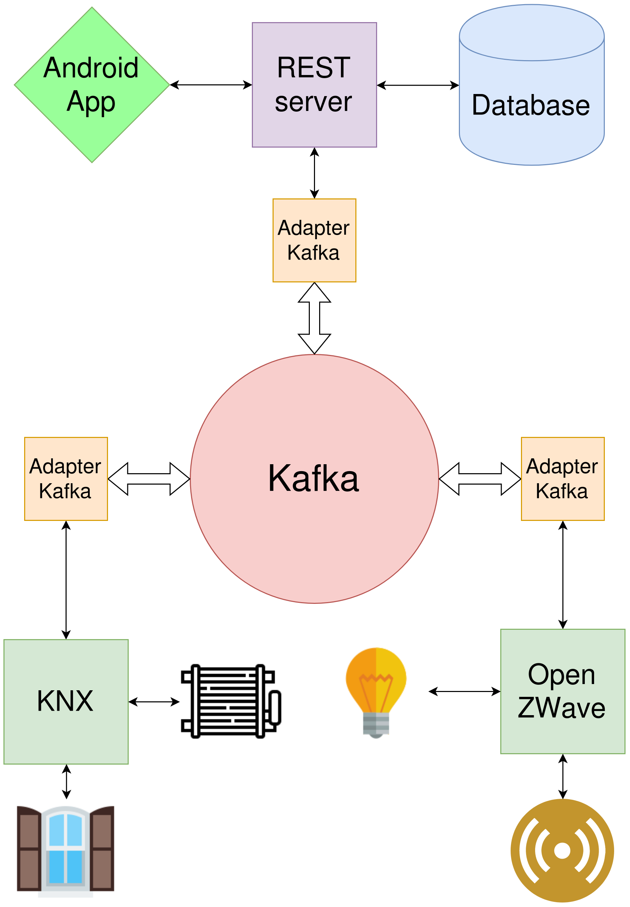

# Introduction
Ce projet concerne le dévelopement d'un logiciel de construction moderne qui offre des fonctionnalités de haut niveau (fonctionnalités pour l'utilisateur final) telles que :
1. Abaisser la température d'une pièce à un seuil donné lorsqu'elle est vide
2. Augmenter la température d'une pièce à un seuil donné lorsqu'elle est occupée
3. Fermer les stores lorsque l'humidité est élevée
4. Ouvrir les stores le jour, lorsque la luminance est faible et que la pièce est occupée
5. Afficher l'état d'un magasin et / ou d'un radiateur donné
6. Surveiller manuellement les stores et les radiateurs de la pièce où se trouve l'utilisateur
7. Fournir des statistiques

Ces fonctionnalités peuvent être activées automatiquement ou manuellement.

La forme "nous" est utilisée tout au long de ce rapport étant donné que ce projet est réalisé par binôme.

## Motivations

Le périmètre de ce projet semblait parfaitement adapté pour exploiter la majorité des techniques et méthodes vues durant le cours d'IOT.
Ce projet est une formidable occasion pour relier la mise en pratique des connaissances acquises en cours et notre passion pour le dévloppement full stack.

## Buts
Le but de cette application est de mettre en pratique les différentes librairies et tecchnologies étudiées en cours d'internet des objets afin de produire une interafce utilisateur déployée sur un smartphone Android.

## Méthodologie de travail

Sur la base d'une analyse préliminaire, nous avons séparé le travail en plusieurs tâches que nous avons assigné à chaque membre du binôme de manière équitable afin d'effectuer le travail en parallèle.
Nous avons adopté une pseudo méthode "agile", en factorisant le projet en petites tâches distinctes et en nous fixant des délais pour les réaliser. Le partage du code s'est fait avec git et gitlab. Nous nous sommes servis des "issues" gitlab pour représenter nos tâches et du "board" du projet pour avoir une vision globale du travail accompli (par qui et quand) et du travail restant.

# Conception et architecture
{width=40%} 

## Protocole d'échange des messages
<!-- Statistiques -->

# Kafka
La technologie d'échange des messages était au choix, nous avons choisi d'experimenter kafka étant donné qu'elle est de plus en plus répendue dans les différents projets, il était donc interessant de la prendre en main au travers de ce projet.
## Généralités
Apache Kafka est une plate-forme de diffusion d'événements distribuée open source, tolérante aux pannes, développée par LinkedIn. Service de journalisation distribué, Kafka est souvent utilisé à la place des courtiers de messages traditionnels en raison de son débit, de son évolutivité, de sa fiabilité et de sa réplication plus élevés. Étant donné que Kafka est un système distribué, les rubriques sont partitionnées et répliquées sur plusieurs noeuds.

Elle permet principalement de : 
    - Publier et s'abonner à des flux d'enregistrements, similaires à une file d'attente de messages ou à un système de messagerie d'entreprise.
    - Stocker les flux d'enregistrements d'une manière durable à tolérance de pannes
    - Traiter les flux d'enregistrements au fur et à mesure qu'ils se produisent.

Les API kafka suivantes sont utilisées dans ce projet :

    - L'API Producer permet à une application de publier un flux d'enregistrements sur un ou plusieurs sujets Kafka.
    - L'API Consumer permet à une application de s'abonner à un ou plusieurs sujets et de traiter le flux d'enregistrements qui leur est produit.

## Usage dans le projet
Dans le cadre de ce projet, nous avons utilisé kafka afin de communiquer entre les différentes entités de l'application.
Chacunes d'entre elles (knx, openzawe, API rest Flask) écoute et produit différents messages dans kafka afin de réagire à certains actions et également de produire des informations sans dépendre de la demande demande des client.
### Topics
Au sein de ce projet, nous faisons usage de deux topics principaux "KNX" et "Zwave" qui nous permettent aux différents services d'éméttre et récéptionner les messages qui les concrenent.

# Implémentation
## Android
Comme nous l'avons mentionné dans les rubriques précédentes, le client à été developpé pour Android. Pour cela, nous avons choisi d'utiliser le langage Kotlin qui est plus preformant et optimise les opérations et la structure en opposition à Java. C'est également le langage que nous utilisons au sein du cours d'Android, c'est donc un bon moyen de mettre en relation les deux cours.

Le rôle principal de ce client est de détecter (grâce au bluetooth) le beacoin avec la plus grande proximité. En fonction de ce beacoin le client peut envoyer une requête permettant de determiner la salle dans laquel se trouve la personne et les devices qui y ont présentes (stors, radiateurs, lumières etc.).Une fois l'emplacement determiné et les devices détéctés, les contrôles et les informations des différents devies apparaissent sur l'interface graphique de l'utilisateur, lui permettant de contrôller ou obtenir les différentes informations des devices à proximité. 

## Broker Kafka
Le broker Kafka joue le rôle de coordinateur entre tous les différents clients qui consomment et produisent des messages dans les différents topics.
Nous avons choisi de déployer ce Broker Kafka sur une instance AWS permettant de le rendre accessible par toutes les entités de l'application.
Nous avons également associé un nom de domaine à cette instace ce qui permet de la référencer de manière plus lisible et agérable par les clients.

## Rest server Flask
Etant donné qu'il n'existe pas enciore de librairie permettant d'utiliser dirctement le client Kafka sur Android, nous avons du mettre en place un adapter que nous permet de faire la translation entre Kafka Android.
Pour ce faire nous avons utilisé la librairie `Flask` de Python 3 qui permet de mettre en place une API REST.
Cette API joue également le rôle de producteur et de consumateur Kafka afin de mettre en relation les différentes entités.
D'une part, le consomateur Kafka se charge de consommer les différents messages de KNX et Openzwave afin de stocker les informations utiles à l'application et aux statistiques dans la base de données.
D'autre part, nous avons le producteur Kafka qui se charge de transformer les actions reçues sous forme de requête HTTP en message Kafka envoyé directement dans le bon topic ce qui permet donc d'effectuer les actions demandées en conséquence (ouverture des stors par exemple).

## Adapter Kafka
??????

## KNX lib
En se basant sur le code de l'exercice KNX réalisé au cours du premier service, nous l'avons adapté
## Zwave lib
## BDD
En ce qui concerne la base de données, nous avons opté pour une base relationnelle avec MySQL qui nous a permis de représenter les différentes structures de données et les mettre en lien facilement et de manière efficace.

Les tables de la base nous permettent de persister les données telles que les devices KNX, les noeuds openzwave, les identifiants des beacons et leurs association avec une room spécifique. Deux tables sont également dediées au stockage des logs pour knx et openzwave afin de pouvoir retracer les données dans le temps et tirer des statistiques.

Voici le diagramme représentant notre base de données :

{width=40%} 

# Conclusion
Pour conclure, ce projet nous a permit d'apprendre et pratiquer Kafka, une technologie initaliemment inconnue, ce qui fût très instructif. Il nous à également permis d'approfondir les notions vue en cours concernant KNX, Openzwave et la detection des beacons depuis un appareil Android. En ajoutant a tout cela une partie devloppement Android, une base de données SQL et l'utilisation de python. Ce qui fait de ce projet un très bon cas pratique permettant de mettre en lien toutes ces technologies plus interessante les unes que les autres. (TODO: Sucage de boule)

## Problèmes rencontrés
- Docker python
- KNX la documentation fournie ne correspondait pas parfaitement avec le fonctionnement réeé du protocole
- Openzwave manque d'informations concernant le reset manuel du controller
## Améliorations
########### INVOCATION DE STEVEN #########s
